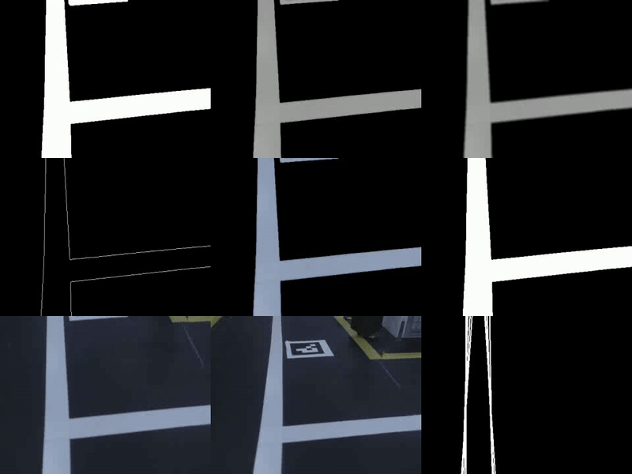

# LiteBot: Real-time Robotic Perception & Control Platform (Experimental)

LiteBot은 실시간 로봇 주행 환경에서 인식(perception)과 제어(control)를 어떻게 구조적으로 분리하고 운영할지를 실험하기 위해 만든 프로젝트다.
완성된 제품/대회 최종 제출용 코드라기보다는, **아키텍처 설계와 실행 모델(비동기/리소스 분리), 하드웨어 추상화(ROS/Tiki)** 를 중심으로 정리된 실험 프로젝트에 가깝다.

또한 이 프로젝트는 2025 국방 AI 경진대회 본선을 대비해, 대회 환경에서 제공되는 하드웨어에 종속적인 구현을 처음부터 끝까지 쌓기보다
ROS 환경에서 먼저 구조를 안정화한 뒤, 본선에서 사용해야 하는 **대회 제공 전용 라이브러리(Tiki SDK)** 로 백엔드를 교체하는 방식으로 빠르게 적응하는 것을 목표로 했다.

현재 기준으로 ROS 백엔드에서는 안정적으로 동작하지만,
대회 제공 Tiki 백엔드는 제어 모델 차이로 인해 완전 통합까지는 완료하지 못했다.
(하드웨어 환경 부재 및 시간 제약 포함)

<br><br>

---

## 1. Overview

LiteBot의 메인 루프는 아래 흐름을 반복한다.  
프레임을 캡처한 뒤 이미지 처리를 거쳐 필요한 정보들을 감지(observation)하고, 트리거가 감지된 정보들을 종합해 현재 상황에서 가장 적절한 액션을 결정한다.

```python
# 1. 프레임 캡처
self.frame = self.camera.get_frame()

# 2. 이미지 처리
self.images = self.image_processor.get_images(self.frame)

# images가 None이면 빈 딕셔너리로 처리
if self.images is None:
    self.images = {}

# 3. 감지 수행
observations = {
    "lane": self.observer.observe_lines(self.images.get("hough")),
    "aruco": self.observer.observe_aruco(self.images.get("original")),
    "pothole": self.observer.observe_pothole(self.images.get("binary")),
    "qr_codes": self.observer.observe_qr_codes(self.images.get("original")),
    # 필요한 경우 다른 감지 추가
}

# 4. 트리거 매니저가 적절한 액션을 반환
action = self.trigger_manager.step(observations)

# 5. 액션 실행
if action:
    self.action_executor.execute(action)
```

<br><br>

---

## 2. Key Features

- 실시간 perception pipeline (차선 인식 + 객체 감지 연계)
- 리소스 기반 비동기 액션 실행 모델  
  (motor/led/oled 등 리소스 단위로 액션 실행을 분리)
- 하드웨어 추상화 구조 (ROS / Tiki 백엔드 교체 가능)
- 이미지 처리 파이프라인 (BEV, 컬러 필터링, Hough Line 등)
- YOLO 추론을 별도 워커로 분리한 detection 구조 (bridge)
- 분석/디버깅 도구 (HLS/RGB viewer, manual drive, recording/logging)
- 테스트 구조 분리 (software / hardware / integration)

<br><br>

---

## 3. System Architecture

LiteBot은 크게 다음 레이어로 구성된다.

- **core/**: 관측(Observer) 및 트리거 관리(Trigger manager)
- **processing/**: 프레임 전처리 및 이미지 파이프라인
- **action/**: 액션 실행기(Action executor) / 리소스 기반 실행 정책
- **io/**: 하드웨어 인터페이스 (ROS / Tiki)
- **ai/**: 객체 감지 워커 및 브릿지(Detection bridge)
- **analysis/**: 디버깅 및 분석 도구
- **tests/**: 로직/하드웨어/통합 테스트

(여기에 블록 다이어그램 1장 넣으면 완성도가 확 올라감)


<br><br>

---

## 4. Real-time Execution Strategy

실시간 주행에서는 프레임 처리(perception)가 끊기면 곧바로 주행 품질이 무너진다.  
그래서 LiteBot은 **프레임 처리 루프와 액션(모터/LED 등)을 분리**하고, 액션은 별도 실행 단위로 관리하는 구조를 목표로 했다.

ROS와 Tiki는 모터를 제어하는 방식 자체가 달라서, 단순히 액션을 스레드로 분리하는 것만으로는 해결되지 않았다.
ROS는 속도 명령을 계속 업데이트하는 방식인 반면, Tiki는 한 번 명령을 내리면 동작이 유지되는 방식에 가깝다.
그래서 핵심 문제는 “비동기 처리”가 아니라, 상위 로직의 제어 명령을 두 환경에서 모두 자연스럽게 동작하도록 맞춰주는 제어 추상화(번역 계층)를 설계하는 일이었다.

<br><br>

---

## 5. Pipeline Details

### 5.1 Image Processing Pipeline
- BEV 변환
- HLS/RGB 이중 필터링
- 그레이스케일/블러/임계값
- 연결 컴포넌트 기반 노이즈 제거
- Canny → Hough Line 기반 차선 검출




### 5.2 Object Detection Pipeline (YOLO Worker + Bridge)
YOLO 추론은 메인 루프에서 직접 돌리지 않고, 워커 프로세스로 분리했다.

- 워커는 `to_detect_images/`를 주기적으로 스캔하고 추론 결과를 `detected.log(JSONL)`로 저장한다.
- LiteBot 쪽은 bridge를 통해 프레임 저장 및 로그를 읽는다.

<br><br>

---

## 6. Challenges & Improvements

### 6.1 ROS ↔ Tiki 통합 이슈
ROS 백엔드에서는 구조가 비교적 안정적으로 동작했지만, 대회 제공 Tiki SDK는 제어 모델이 달라 완전 통합이 어려웠다.  
ROS는 선속도/각속도를 주기적으로 갱신하는 방식에 가깝고, Tiki는 RPM 또는 forward() 같은 동작을 한 번 실행하면 유지되는 방식에 가깝다.  
이 차이 때문에 단순히 v,w → RPM 변환 함수를 추가하는 방식으로는 실제 주행에서 기대만큼 안정적으로 동작하지 않았다.

결국 이 문제는 “스레드를 어떻게 짜느냐”보다, 상위 로직이 사용할 중립적인 제어 추상화(또는 하드웨어별 전용 제어 로직)를 어떻게 설계할지에 가까운 문제였다.

### 6.2 더 나은 개선점: 리소스별 Trigger/Executor 분리(디버깅/실험 단위 축소)
현재 구조는 TriggerManager가 모든 관찰 정보(observation)를 한 번에 종합해 단 하나의 액션을 결정하는 방식이다.  
이 방식은 단순하고 빠르게 구현하기 좋지만, 대회처럼 시간이 촉박한 상황에서 문제가 발생하면 TriggerManager와 ActionExecutor 전체를 함께 의심해야 해서 디버깅 범위가 넓어질 수 있다.

개선 방향으로는 TriggerManager와 ActionExecutor를 리소스별(motor/led/oled 등)로 분리하여, 각 리소스가 독립적으로 의사결정과 실행 흐름을 갖도록 설계하는 방법을 고려할 수 있다.  
이렇게 분리하면 문제가 생겼을 때 해당 리소스에 해당하는 로직만 집중적으로 수정/검증할 수 있어 디버깅 시간이 줄어들고, 특히 대회 제공 Tiki SDK 통합처럼 모터 제어가 핵심인 경우에는 모터 리소스만 분리해서 빠르게 실험할 수 있다.

실행 측면에서도 리소스별 워커 스레드를 두고(리소스 내부 충돌 정책 포함), 프레임 처리 루프(perception)가 블로킹되지 않도록 하면서 각 리소스가 독립적으로 동작하게 만드는 구조가 더 현실적일 수 있다.

<br><br>

---

## 7. Limitations / Known Issues

- Tiki 백엔드 완전 통합 미완성  
  (제어 모델 차이 + 시간 제약 + 환경 제약)
- 실제 하드웨어에서 장기/반복 테스트 부족
- 일부 액션 정책(리소스별 실행/상호 배제)은 ROS 기준으로만 충분히 검증됨


<br><br>

## 8. Repository Structure

```
litebot/
├── litebot/                       
│   ├── core/                    
│   │   ├── observer.py          
│   │   ├── trigger_manager.py   
│   │   ├── trigger_lane.py
│   │   ├── trigger_aruco.py
│   │   ├── trigger_pothole.py
│   │   ├── trigger_qrcode.py
│   │   └── fire_detector.py    # 화재 건물 상태 감지 (파일 기반)
│   │
│   ├── action/                  
│   │   └── action_executor.py
│   │
│   ├── io/                      
│   │   ├── camera_interface.py
│   │   ├── controller_interface.py
│   │   ├── ros/                 
│   │   │   ├── ros_camera.py
│   │   │   └── ros_controller.py
│   │   └── tiki/                
│   │       ├── tiki_camera.py
│   │       ├── tiki_controller.py
│   │       ├── tiki_sensor.py
│   │       ├── tiki_led.py
│   │       └── tiki_oled.py
│   │
│   ├── processing/              
│   │   ├── image_processor.py
│   │   └── image_yolo.py
│   │
│   ├── analysis/                # 주행 데이터, 분석 기록용
│   │   ├── analysis_manager.py
│   │   ├── video_recorder.py
│   │   ├── hls_viewer.py        # HLS/RGB 범위 분석 도구
│   │   └── manual_drive.py     # 수동 주행 테스트 도구
│   │
│   ├── configs/                 # 감지, 추론, 주행 설정 등
│   │   ├── lane_config.py
│   │   ├── aruco_rules.py
│   │   └── video_config.py
│   │
│   └── utils/                   
│       ├── aruco_utils.py
│       ├── check_utils.py
│       └── image_utils.py       # BEV, color_filter, get_largest_component 등
│
├── examples/
│   ├── ros/
│   │   ├── run_ros.py                  # 기본 실행 (튜토리얼 1단계와 동일)
│   │   ├── 1_run_simple.py             # 튜토리얼 1: 최소 구성
│   │   ├── 2_run_with_video.py         # 튜토리얼 2: 주행 + 비디오 녹화
│   │   ├── 3_run_parallel_obs.py       # 튜토리얼 3: 병렬 관측 처리
│   │   └── 4_run_with_detection.py     # 튜토리얼 4: DetectionBridge 연계
│   └── tiki/
│       ├── 1_run_simple.py      # 기본 실행
│       ├── 2_test_sensors.py     # 센서 테스트
│       └── 3_test_led.py          # LED 테스트
│
├── ai/
│   ├── detection_bridge.py
│   └── object_detector.py
│
├── models/                    # YOLO 등 추론 가중치(.pt) 보관
│   └── (예: best_rokaf.pt)
│
├── tests/                       
│   ├── software/                # 소프트웨어 로직 테스트
│   │   ├── manual_check.py
│   │   ├── test_resource_separation.py
│   │   └── test_detection_bridge.py
│   ├── hardware/                # 하드웨어 연동 테스트
│   │   ├── ros_controller_run.py
│   │   ├── ros_executor_run.py
│   │   ├── ros_resource_separation.py
│   │   ├── ros_camera_run.py
│   │   └── tiki_*.py (동일 구조)
│   ├── integration/             # 통합 테스트
│   │   ├── capture_pothole.py
│   │   └── capture_aruco.py
│   ├── test_largest_component.py
│   └── test_fire_detector.py
│
├── README.md
├── setup.py
└── requirements.txt
```

<br><br>

---

## 9. Tech Stack

Python, OpenCV, YOLO, ROS1, Linux, Jetson, threading/CLI 기반 도구

